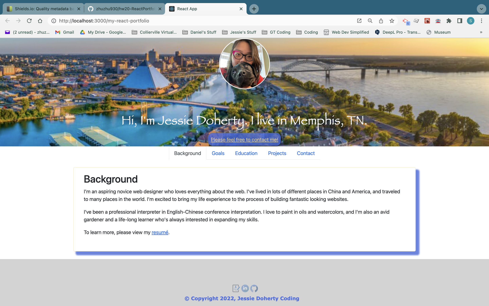
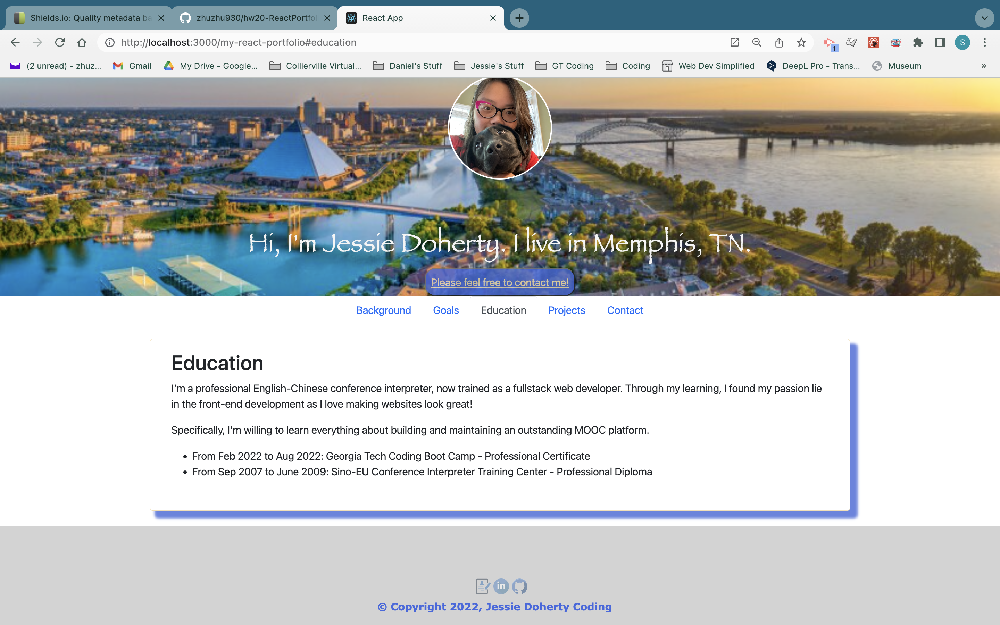
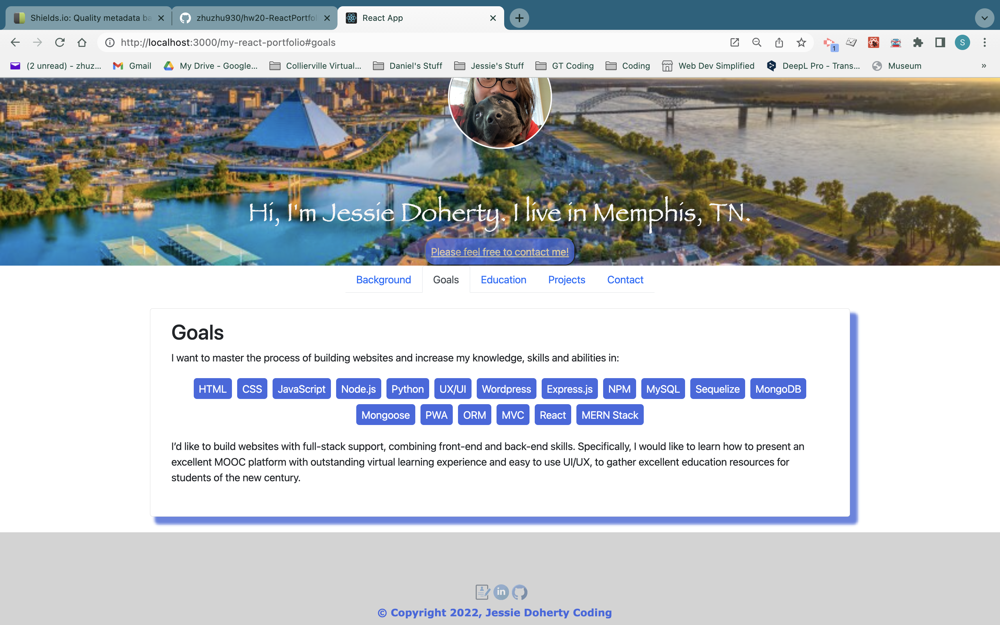
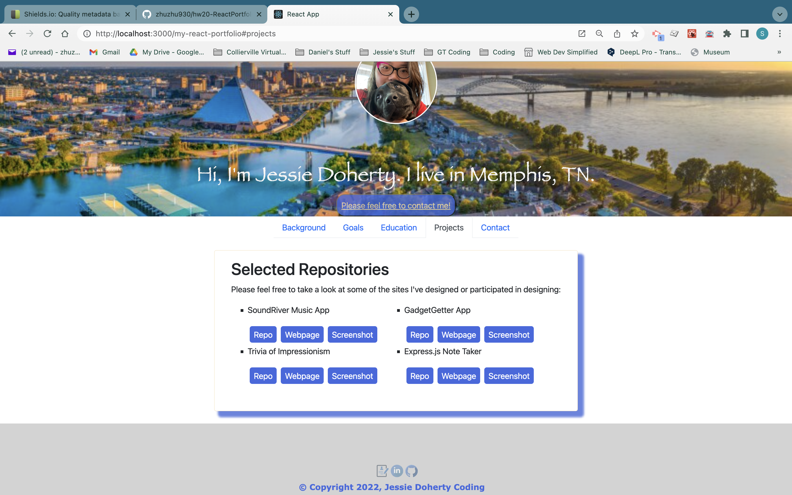
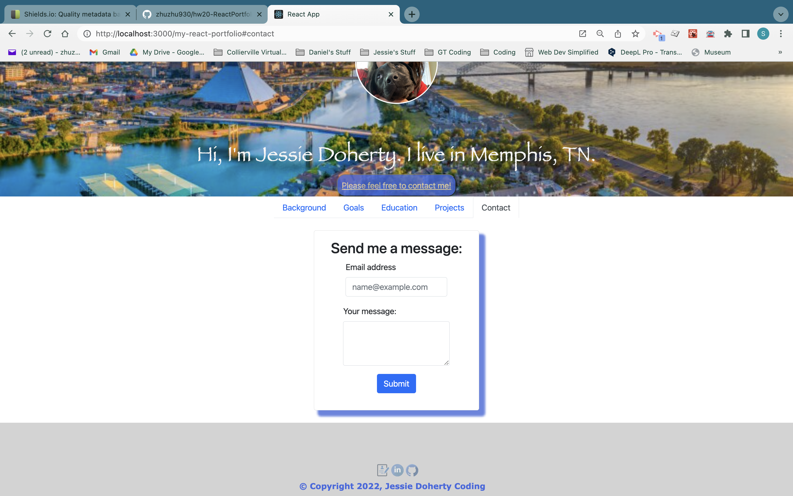

# My React Portfolio

Designed by: Jessie Doherty

## Description

My professional portfolio using React.js.

- What was your motivation?
- Answer: To show my work with the latest web development technologies.
- Why did you build this project?
- Answer: Present a professional portfolio using the latest technologies.
- What problem does it solve?
- Answer: Using React.js to present a portfolio page.
- What did you learn?
- Answer: React.js, Node.js, NPM, Webpack, etc.

## Installation

Please tell us the 3 simple steps for installing your app.

- Step 1: Run `npm install` to install all the dependencies;
- Step 2: Run `npm start` to start the site locally;
- Step 3: If you want to deploy the site, run `npm run build` then `npm run deploy`.

## Usage

- Screenshots of the website

  - Background:
    

  - Education:
    

  - Goals:
    

  - Projects:
    

  - Contact:
    

## Credits

    Tutorials: LinkedIn Learn: Learning React.js(2019)

## License

    MIT License

    Copyright (c) 2022 Jessie Doherty

    Permission is hereby granted, free of charge, to any person obtaining a copy
    of this software and associated documentation files (the "Software"), to deal
    in the Software without restriction, including without limitation the rights
    to use, copy, modify, merge, publish, distribute, sublicense, and/or sell
    copies of the Software, and to permit persons to whom the Software is
    furnished to do so, subject to the following conditions:

    The above copyright notice and this permission notice shall be included in all
    copies or substantial portions of the Software.

    THE SOFTWARE IS PROVIDED "AS IS", WITHOUT WARRANTY OF ANY KIND, EXPRESS OR
    IMPLIED, INCLUDING BUT NOT LIMITED TO THE WARRANTIES OF MERCHANTABILITY,
    FITNESS FOR A PARTICULAR PURPOSE AND NONINFRINGEMENT. IN NO EVENT SHALL THE
    AUTHORS OR COPYRIGHT HOLDERS BE LIABLE FOR ANY CLAIM, DAMAGES OR OTHER
    LIABILITY, WHETHER IN AN ACTION OF CONTRACT, TORT OR OTHERWISE, ARISING FROM,
    OUT OF OR IN CONNECTION WITH THE SOFTWARE OR THE USE OR OTHER DEALINGS IN THE
    SOFTWARE.

    ---

## 🏆 Miscellaneous

## Badges

- 
- 

## Features

- This is a single-page website that shows my background, goals, education, selected repositaries and contact information.

## How to Contribute

- This repo is open to the public for your reference.

## URL

- [GitHub](https://github.com/zhuzhu930/hw20-ReactPortfolio-JD)
- [Deployed website](https://zhuzhu930.github.io/hw20-ReactPortfolio-JD/)
